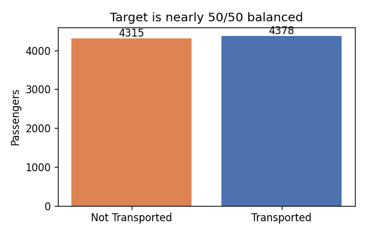
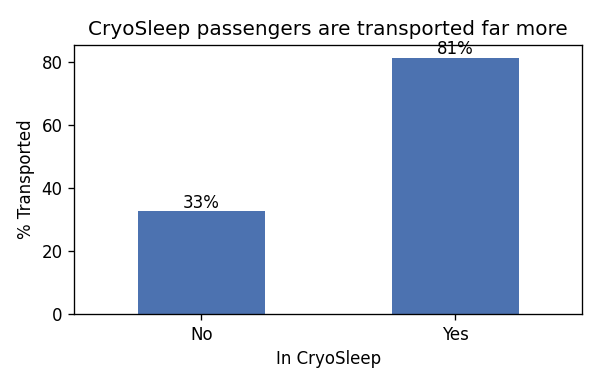
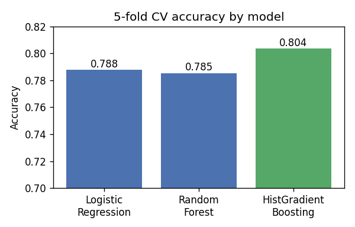
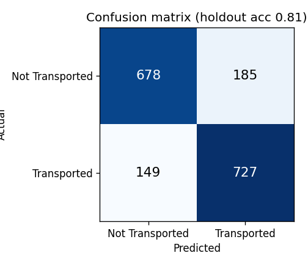
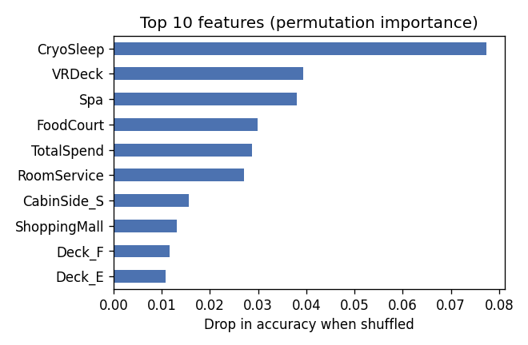

# Spaceship Titanic: Predicting Who Got Transported

This is my newbie 🍼 ML project on the [Kaggle Spaceship Titanic](https://www.kaggle.com/competitions/spaceship-titanic) dataset. The project is to predict which passengers were transported to another dimension after the ship hit a spacetime anomaly. It is a binary classification problem. I self-learn from the materials from - Kaggle courses, Google ML Crash Courses, my own custom agent from Claude to design a 30-days ML program including related YouTube videos.

### Please feel free to leave me any comments (or 📩 👉 natkuma@outlook.com) on how to improve this project, I'm super new to this topic, your advice will be VERY helpful for my learning journey!!
# 

**Best model:** HistGradientBoosting, about **81% accuracy** (holdout and 5-fold cross-validation), which is in the same range as strong public solutions for this competition.

The full write-up with charts and step-by-step explanation is in [`notebooks/spaceship-titanic.ipynb`](notebooks/spaceship-titanic.ipynb). A clean script version is in [`src/pipeline.py`](src/pipeline.py).

## Version history

| Version | Date | Notes |
| --- | --- | --- |
| 1.0 | 2026&#8209;09&#8209;01 | My first attempt at training a machine learning model. I used AI-generated advice extensively to help me learn the workflow and build this project. |
| 1.1 |  | Use less help from AI tools while continuing to research effective strategies for predicting a particular dataset. |
| 1.2 |  | Improve feature engineering and model evaluation through more independent experimentation. |
| 1.3 |  | Tune model settings and compare stronger approaches to improve prediction performance. |

---

## The problem

Each row is a passenger. Some columns describe them (home planet, age, cabin), some describe what they did on board (how much they spent on food, spa, and so on), and one column, `Transported`, is what we want to predict. The target is almost perfectly 50/50, so plain accuracy is a fair way to score the model.



## What I did

### 1. Feature engineering

Two raw columns held more information than they looked like:

- `PassengerId` (like `0001_01`) encodes a travel **group** and a person's number within it. I pulled out the group and computed `GroupSize`, how many people travelled together.
- `Cabin` (like `B/0/P`) encodes **deck / number / side**. I split it into `Deck`, `CabinNum` and `CabinSide`.

I also added `TotalSpend`, the sum of all five spending columns.

### 2. Filling missing values with logic

About 2% of cells were missing. Instead of filling everything with a single average, I used patterns in the data:

- **CryoSleep:** passengers asleep in a pod could not spend money, so when CryoSleep was missing I inferred it from spending (spent nothing means probably asleep). This alone matches the real value about 90% of the time.
- **HomePlanet and CabinSide:** people in the same travel group share these, so I copied the value from their group-mates. I checked first that groups really do share a cabin side, and it held for 100% of groups.
- **Spending columns:** a missing charge almost certainly means no charge, so I filled with 0.
- **Everything else:** the most common value, and the median for age.

The CryoSleep pattern also turned out to be the single strongest signal for the prediction:



### 3. Comparing models

I compared three models with 5-fold cross-validation, so the score is an average over five different splits rather than one lucky split:



| Model | CV accuracy |
| --- | --- |
| Logistic Regression | 0.788 |
| Random Forest | 0.785 |
| HistGradientBoosting | **0.804** |

HistGradientBoosting (boosted trees) came out ahead, which is typical for this kind of tabular data.

## Results

On a 20% holdout set the model never trained on, it reached **81% accuracy** with errors spread fairly evenly across both classes (it is not just always guessing one answer):



Looking at which features mattered (permutation importance, meaning how much accuracy drops when a feature is shuffled), CryoSleep and the spending columns dominate. That matches what I saw during exploration, which is a good sign the model learned something real and explainable.



## Machine learning concepts shown here

- Train/validation split and 5-fold cross-validation
- Feature engineering from raw columns
- Thoughtful missing-value imputation (using data structure, not just averages)
- One-hot encoding of categorical features
- Comparing multiple models fairly
- Reading a confusion matrix and precision/recall
- Permutation importance to explain the model
- Avoiding data leakage by applying the exact same steps to train and test

## How to run it

```bash
# 1. Install the dependencies
pip install -r requirements.txt

# 2. Download the data from Kaggle and put the CSVs in data/
#    https://www.kaggle.com/competitions/spaceship-titanic/data
#    (data/ is gitignored because Kaggle asks you not to redistribute it)

# 3a. Run the script version end to end
python src/pipeline.py

# 3b. Or open the notebook to see the full walkthrough with charts
jupyter notebook notebooks/spaceship-titanic.ipynb
```

Both produce `submissions/submission.csv`, ready to upload to Kaggle.

## What I would try next

- Tune the model settings with a grid search (learning rate, tree depth, number of trees).
- Add features like spend-per-person in a group, or a simple "spent anything at all" flag.
- Try XGBoost or LightGBM, and blend a few models together.

---

# Please feel free to leave me any comment on how to improve this project, I'm super new to this topic, your advice will be very helpful for my learning journey!!
